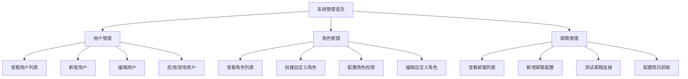
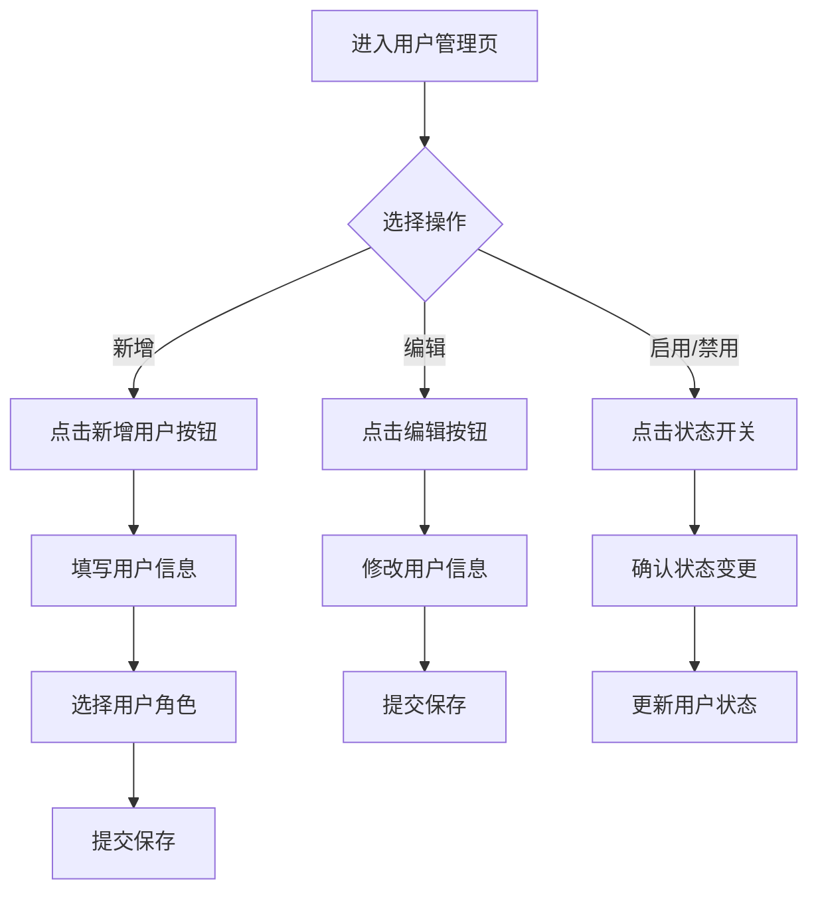

## 1. 产品概述

系统管理模块为HR系统提供后台管理功能，包括用户管理、角色管理和招聘邮箱管理。该模块帮助管理员有效管控系统用户权限，配置招聘流程中的邮箱服务，确保系统安全有序运行。

目标用户为系统管理员和HR主管，通过集中化管理提升系统运维效率，支持灵活的权限配置和自动化简历收集。

## 2. 核心功能

### 2.1 用户角色

| 角色    | 注册方式       | 核心权限                       |
| ----- | ---------- | -------------------------- |
| 普通用户  | 管理员创建或邮箱注册 | 查看个人信息、使用招聘功能、查看分配的数据      |
| 系统管理员 | 系统内置，不可删除  | 用户管理、角色管理、邮箱管理、系统配置、所有数据权限 |
| 自定义角色 | 管理员创建      | 根据配置的权限范围进行操作              |

### 2.2 功能模块

系统管理模块包含以下核心页面：

1. **系统管理首页**：系统概览、快捷入口、数据统计
2. **用户管理页**：用户列表、新增用户、编辑用户、启用/禁用用户
3. **角色管理页**：角色列表、内置角色展示、自定义角色创建编辑、权限配置
4. **招聘邮箱管理页**：邮箱列表、新增邮箱、邮箱配置、连接测试、简历抓取

### 2.3 页面详情

| 页面名称    | 模块名称  | 功能描述                      |
| ------- | ----- | ------------------------- |
| 系统管理首页  | 系统概览  | 显示系统用户数、角色数、邮箱数等统计信息      |
| 系统管理首页  | 快捷入口  | 提供快速跳转到用户管理、角色管理、邮箱管理的入口  |
| 用户管理页   | 用户列表  | 展示所有用户，支持分页、搜索、筛选功能       |
| 用户管理页   | 新增用户  | 创建新用户，填写用户名、邮箱、角色等基本信息    |
| 用户管理页   | 编辑用户  | 修改用户信息，包括基本信息和角色分配        |
| 用户管理页   | 启用/禁用 | 控制用户账号状态，禁用后用户无法登录        |
| 角色管理页   | 角色列表  | 展示系统所有角色，区分内置角色和自定义角色     |
| 角色管理页   | 内置角色  | 展示普通用户和系统管理员两个内置角色，不可编辑删除 |
| 角色管理页   | 自定义角色 | 支持创建、编辑、删除自定义角色           |
| 角色管理页   | 权限配置  | 为角色分配系统功能权限，采用模块化权限设计     |
| 招聘邮箱管理页 | 邮箱列表  | 展示所有配置的招聘邮箱，显示连接状态        |
| 招聘邮箱管理页 | 新增邮箱  | 添加新的招聘邮箱，配置IMAP/SMTP参数    |
| 招聘邮箱管理页 | 邮箱配置  | 设置邮箱服务器地址、端口、用户名、密码等      |
| 招聘邮箱管理页 | 连接测试  | 测试邮箱连接是否成功，验证配置正确性        |
| 招聘邮箱管理页 | 简历抓取  | 手动触发或设置自动抓取简历的时间间隔        |

## 3. 核心流程

### 管理员操作流程

### 用户管理流程

## 4. 用户界面设计

### 4.1 设计风格

延续JD管理页面的设计风格：

* **主色调**：渐变背景（#667eea到#764ba2），白色卡片

* **按钮样式**：圆角按钮，主要操作为渐变色背景

* **字体**：主标题28px加粗，正文14-16px

* **布局风格**：卡片式布局，左右分栏结构

* **图标风格**：使用Element Plus图标库，线性图标

### 4.2 页面设计概述

| 页面名称    | 模块名称    | UI元素                                     |
| ------- | ------- | ---------------------------------------- |
| 系统管理首页  | 统计卡片    | 采用与JD列表相同的卡片样式，显示用户数、角色数、邮箱数，使用渐变图标和数字展示 |
| 系统管理首页  | 快捷入口    | 网格布局的快捷按钮，采用与JD生成页面相同的渐变色按钮样式            |
| 用户管理页   | 用户列表    | 左侧为用户列表（类似JD列表），右侧为用户详情编辑区域（类似JD编辑区）     |
| 用户管理页   | 新增/编辑弹窗 | 使用Element Plus的Dialog组件，表单布局参考JD编辑区的配置面板 |
| 角色管理页   | 角色列表    | 左侧角色列表，右侧权限配置面板，采用与JD管理相同的左右分栏布局         |
| 角色管理页   | 权限树     | 使用Element Plus的Tree组件，支持多级权限选择           |
| 招聘邮箱管理页 | 邮箱列表    | 列表展示邮箱配置，包含连接状态指示器，采用与JD列表相似的卡片设计        |
| 招聘邮箱管理页 | 配置表单    | 分步骤的表单设计，包含服务器配置、连接测试、抓取设置等步骤            |

### 4.3 响应式设计

* **桌面端优先**：默认适配1920px宽度，最小支持1200px

* **平板适配**：768px-1200px，侧边栏可收起，列表和编辑区域上下排列

* **移动端**：小于768px，采用移动端导航，列表和详情分页面展示

* **触摸优化**：按钮和交互元素适配触摸操作，增大点击区域

## 5. 技术实现要求

### 5.1 前端技术

* 基于Vue 3 + Element Plus框架

* 复用JD管理页面的组件和样式

* 采用相同的布局结构和交互模式

* 支持响应式设计和移动端适配

### 5.2 后端接口

* 用户管理：用户CRUD操作，状态管理

* 角色管理：角色CRUD，权限配置，内置角色保护

* 邮箱管理：邮箱配置，连接测试，简历抓取

### 5.3 数据安全

* 用户密码加密存储

* 角色权限验证，防止越权访问

* 邮箱密码等敏感信息加密存储

* 操作日志记录，便于审计追踪

