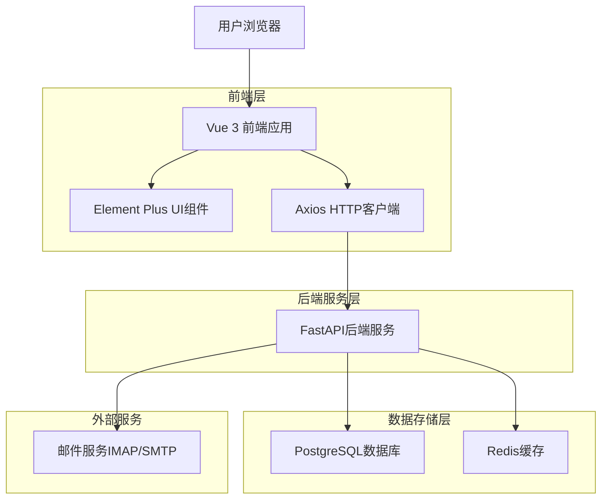
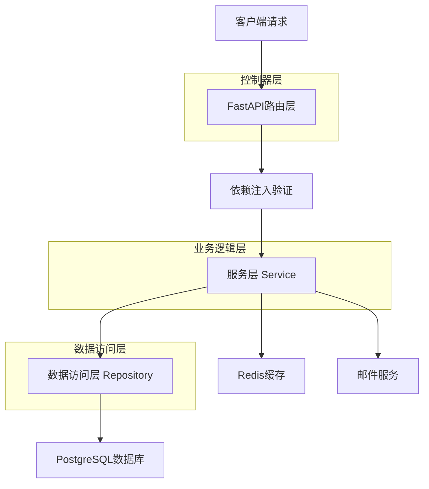
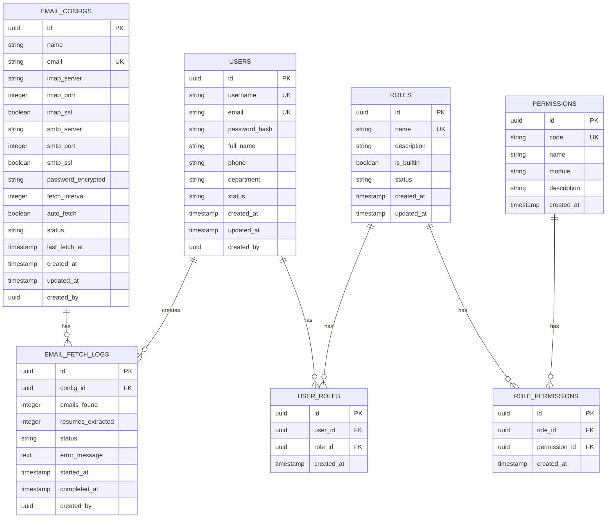

## 1. 架构设计



## 2. 技术描述

- **前端**: Vue 3 + Element Plus + Vite + SCSS
- **后端**: FastAPI + SQLAlchemy + Pydantic
- **数据库**: PostgreSQL 14+
- **缓存**: Redis 6+
- **邮件服务**: Python imaplib/smtplib

## 3. 路由定义

| 路由 | 用途 |
|-------|---------|
| /admin | 系统管理首页，显示统计信息和快捷入口 |
| /admin/users | 用户管理页面，用户列表和CRUD操作 |
| /admin/roles | 角色管理页面，角色列表和权限配置 |
| /admin/email-configs | 招聘邮箱管理页面，邮箱配置和简历抓取 |

## 4. API定义

### 4.1 用户管理API

```
GET /api/v1/users
```
获取用户列表

请求参数:
| 参数名 | 参数类型 | 是否必需 | 描述 |
|-----------|-------------|-------------|-------------|
| page | integer | false | 页码，默认为1 |
| size | integer | false | 每页数量，默认为10 |
| search | string | false | 搜索关键词 |
| status | string | false | 用户状态筛选 |

响应:
| 参数名 | 参数类型 | 描述 |
|-----------|-------------|-------------|
| items | array | 用户数据数组 |
| total | integer | 总记录数 |
| page | integer | 当前页码 |
| size | integer | 每页数量 |

```
POST /api/v1/users
```
创建新用户

请求体:
```json
{
  "username": "zhangsan",
  "email": "zhangsan@example.com",
  "password": "secure_password",
  "role_id": "role_uuid",
  "full_name": "张三",
  "department": "技术部",
  "phone": "13800138000",
  "status": "active"
}
```

```
PUT /api/v1/users/{user_id}
```
更新用户信息

```
DELETE /api/v1/users/{user_id}
```
删除用户（软删除）

```
PATCH /api/v1/users/{user_id}/status
```
更新用户状态

请求体:
```json
{
  "status": "disabled"
}
```

### 4.2 角色管理API

```
GET /api/v1/roles
```
获取角色列表

```
POST /api/v1/roles
```
创建新角色

请求体:
```json
{
  "name": "HR专员",
  "description": "负责招聘流程的HR人员",
  "permissions": ["user.read", "resume.read", "resume.create", "interview.read"],
  "is_builtin": false
}
```

```
PUT /api/v1/roles/{role_id}
```
更新角色信息

```
DELETE /api/v1/roles/{role_id}
```
删除自定义角色（内置角色不可删除）

### 4.3 邮箱管理API

```
GET /api/v1/email-configs
```
获取邮箱配置列表

```
POST /api/v1/email-configs
```
创建邮箱配置

请求体:
```json
{
  "name": "招聘邮箱",
  "email": "hr@company.com",
  "imap_server": "imap.company.com",
  "imap_port": 993,
  "imap_ssl": true,
  "smtp_server": "smtp.company.com",
  "smtp_port": 587,
  "smtp_ssl": true,
  "password": "email_password",
  "fetch_interval": 30,
  "auto_fetch": true,
  "status": "active"
}
```

```
POST /api/v1/email-configs/{config_id}/test
```
测试邮箱连接

```
POST /api/v1/email-configs/{config_id}/fetch
```
手动触发简历抓取

```
PUT /api/v1/email-configs/{config_id}/status
```
更新邮箱状态

## 5. 服务器架构图



## 6. 数据模型

### 6.1 数据模型定义



### 6.2 数据定义语言

用户表 (users)
```sql
CREATE TABLE users (
    id UUID PRIMARY KEY DEFAULT gen_random_uuid(),
    username VARCHAR(50) UNIQUE NOT NULL,
    email VARCHAR(255) UNIQUE NOT NULL,
    password_hash VARCHAR(255) NOT NULL,
    full_name VARCHAR(100) NOT NULL,
    phone VARCHAR(20),
    department VARCHAR(100),
    status VARCHAR(20) DEFAULT 'active' CHECK (status IN ('active', 'disabled', 'locked')),
    created_at TIMESTAMP WITH TIME ZONE DEFAULT NOW(),
    updated_at TIMESTAMP WITH TIME ZONE DEFAULT NOW(),
    created_by UUID REFERENCES users(id)
);

CREATE INDEX idx_users_username ON users(username);
CREATE INDEX idx_users_email ON users(email);
CREATE INDEX idx_users_status ON users(status);
```

角色表 (roles)
```sql
CREATE TABLE roles (
    id UUID PRIMARY KEY DEFAULT gen_random_uuid(),
    name VARCHAR(100) UNIQUE NOT NULL,
    description TEXT,
    is_builtin BOOLEAN DEFAULT FALSE,
    status VARCHAR(20) DEFAULT 'active' CHECK (status IN ('active', 'inactive')),
    created_at TIMESTAMP WITH TIME ZONE DEFAULT NOW(),
    updated_at TIMESTAMP WITH TIME ZONE DEFAULT NOW()
);

-- 插入内置角色
INSERT INTO roles (name, description, is_builtin) VALUES 
('普通用户', '系统普通用户，具有基本权限', true),
('系统管理员', '系统管理员，具有所有权限', true);
```

用户角色关联表 (user_roles)
```sql
CREATE TABLE user_roles (
    id UUID PRIMARY KEY DEFAULT gen_random_uuid(),
    user_id UUID NOT NULL REFERENCES users(id) ON DELETE CASCADE,
    role_id UUID NOT NULL REFERENCES roles(id) ON DELETE CASCADE,
    created_at TIMESTAMP WITH TIME ZONE DEFAULT NOW(),
    UNIQUE(user_id, role_id)
);

CREATE INDEX idx_user_roles_user_id ON user_roles(user_id);
CREATE INDEX idx_user_roles_role_id ON user_roles(role_id);
```

权限表 (permissions)
```sql
CREATE TABLE permissions (
    id UUID PRIMARY KEY DEFAULT gen_random_uuid(),
    code VARCHAR(100) UNIQUE NOT NULL,
    name VARCHAR(100) NOT NULL,
    module VARCHAR(50) NOT NULL,
    description TEXT,
    created_at TIMESTAMP WITH TIME ZONE DEFAULT NOW()
);

-- 插入基础权限数据
INSERT INTO permissions (code, name, module, description) VALUES 
('user.read', '查看用户', '用户管理', '查看用户列表和详情'),
('user.create', '创建用户', '用户管理', '创建新用户'),
('user.update', '更新用户', '用户管理', '更新用户信息'),
('user.delete', '删除用户', '用户管理', '删除用户'),
('role.read', '查看角色', '角色管理', '查看角色列表和详情'),
('role.create', '创建角色', '角色管理', '创建新角色'),
('role.update', '更新角色', '角色管理', '更新角色信息'),
('role.delete', '删除角色', '角色管理', '删除角色'),
('email.read', '查看邮箱配置', '邮箱管理', '查看邮箱配置列表'),
('email.create', '创建邮箱配置', '邮箱管理', '创建新邮箱配置'),
('email.update', '更新邮箱配置', '邮箱管理', '更新邮箱配置'),
('email.delete', '删除邮箱配置', '邮箱管理', '删除邮箱配置'),
('email.test', '测试邮箱连接', '邮箱管理', '测试邮箱连接'),
('email.fetch', '抓取简历', '邮箱管理', '手动触发简历抓取');
```

角色权限关联表 (role_permissions)
```sql
CREATE TABLE role_permissions (
    id UUID PRIMARY KEY DEFAULT gen_random_uuid(),
    role_id UUID NOT NULL REFERENCES roles(id) ON DELETE CASCADE,
    permission_id UUID NOT NULL REFERENCES permissions(id) ON DELETE CASCADE,
    created_at TIMESTAMP WITH TIME ZONE DEFAULT NOW(),
    UNIQUE(role_id, permission_id)
);

CREATE INDEX idx_role_permissions_role_id ON role_permissions(role_id);
CREATE INDEX idx_role_permissions_permission_id ON role_permissions(permission_id);
```

邮箱配置表 (email_configs)
```sql
CREATE TABLE email_configs (
    id UUID PRIMARY KEY DEFAULT gen_random_uuid(),
    name VARCHAR(100) NOT NULL,
    email VARCHAR(255) UNIQUE NOT NULL,
    imap_server VARCHAR(255) NOT NULL,
    imap_port INTEGER NOT NULL DEFAULT 993,
    imap_ssl BOOLEAN DEFAULT TRUE,
    smtp_server VARCHAR(255) NOT NULL,
    smtp_port INTEGER NOT NULL DEFAULT 587,
    smtp_ssl BOOLEAN DEFAULT TRUE,
    password_encrypted TEXT NOT NULL,
    fetch_interval INTEGER DEFAULT 30,
    auto_fetch BOOLEAN DEFAULT FALSE,
    status VARCHAR(20) DEFAULT 'active' CHECK (status IN ('active', 'inactive', 'error')),
    last_fetch_at TIMESTAMP WITH TIME ZONE,
    created_at TIMESTAMP WITH TIME ZONE DEFAULT NOW(),
    updated_at TIMESTAMP WITH TIME ZONE DEFAULT NOW(),
    created_by UUID REFERENCES users(id)
);

CREATE INDEX idx_email_configs_email ON email_configs(email);
CREATE INDEX idx_email_configs_status ON email_configs(status);
```

邮箱抓取日志表 (email_fetch_logs)
```sql
CREATE TABLE email_fetch_logs (
    id UUID PRIMARY KEY DEFAULT gen_random_uuid(),
    config_id UUID NOT NULL REFERENCES email_configs(id) ON DELETE CASCADE,
    emails_found INTEGER DEFAULT 0,
    resumes_extracted INTEGER DEFAULT 0,
    status VARCHAR(20) NOT NULL CHECK (status IN ('running', 'success', 'failed')),
    error_message TEXT,
    started_at TIMESTAMP WITH TIME ZONE DEFAULT NOW(),
    completed_at TIMESTAMP WITH TIME ZONE,
    created_by UUID REFERENCES users(id)
);

CREATE INDEX idx_fetch_logs_config_id ON email_fetch_logs(config_id);
CREATE INDEX idx_fetch_logs_status ON email_fetch_logs(status);
CREATE INDEX idx_fetch_logs_created_at ON email_fetch_logs(created_at DESC);
```